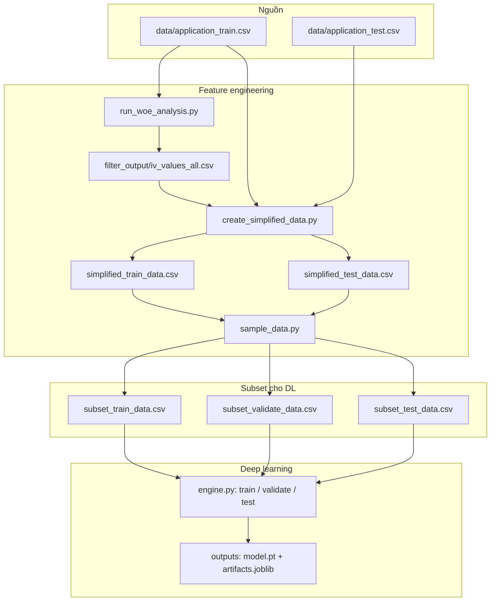

# Kiến trúc và luồng hoạt động

Tài liệu này mô tả **cấu trúc thành phần** và **luồng dữ liệu** của dự án Credit Risk — Home Credit (Top 20 IV + Deep Learning). Chi tiết cài đặt và lệnh chạy: [`README.md`](README.md).

---

## 1. Tổng quan

| Lớp | Vai trò |
|-----|--------|
| **Dữ liệu gốc** | CSV Home Credit (`data/application_*.csv`) — nhị phân `TARGET`. |
| **Feature engineering** | IV/WoE → chọn Top 20 → CSV rút gọn + subset cho train/val/test. |
| **Nhãn proxy 5 cấp** | Sinh **trong pipeline DL** từ `TARGET` + `CreditRatingLabeler` (LR + quantile), không lưu sẵn cột 0–4 trong CSV. |
| **Mô hình DL** | Mạng bảng: embedding + Residual MLP; đầu ra **Softmax** hoặc **CORAL** (ordinal). |
| **Vận hành** | Docker Compose mount repo → `./` trên host = `/workspace` trong container: mọi input/output vẫn nằm trong thư mục dự án. |

---

## 2. Sơ đồ pipeline (mức cao)



---

## 3. Luồng dữ liệu chi tiết

### 3.1 WoE / IV

- **Đầu vào:** `data/application_train.csv` (đường dẫn resolve theo **gốc repo**, không phụ thuộc thư mục làm việc — kể cả khi chạy Docker với `working_dir` = `filter_data`).
- **Đầu ra:** `filter_output/` — `iv_values_all.csv`, biểu đồ WoE/IV cho từng biến và tóm tắt Top 20.

### 3.2 Rút gọn Top 20

- **Đầu vào:** `filter_output/iv_values_all.csv`, `data/application_train.csv`, `data/application_test.csv`.
- **Đầu ra:** `simplified_train_data.csv`, `simplified_test_data.csv` (chỉ cột `SK_ID_CURR`, `TARGET` nếu có, + Top 20 đặc trưng).

### 3.3 Lấy mẫu

- **Script:** `sample_data.py` — cắt các khối dòng từ simplified để train nhanh hơn và tách tập kiểm định.
- **Đầu ra:** `subset_train_data.csv`, `subset_test_data.csv`, `subset_train2_data.csv`, `subset_validate_data.csv`.

### 3.4 Train / validate / test (DL)

- **Train:** đọc CSV có `TARGET` → `fit_training_pipeline` (`pipeline.py`): `TabularPreprocessor` + `CreditRatingLabeler.fit_transform` → nhãn 0…4 → `StandardScaler` → huấn luyện `TabularDeepCreditNet` → lưu `deep_credit_rating/outputs/<mlp_softmax|mlp_coral>/` (`model.pt`, `artifacts.joblib`, `train_meta.json`).
- **Validate:** load checkpoint + `artifacts` → transform cùng preprocessor/scaler; nhãn 5 lớp từ `labeler.transform(X_num_raw, y_bin)` (không fit lại labeler) → metrics (QWK, F1, confusion…).
- **Test:** nếu không có `TARGET` thì chỉ suy luận và ghi `predictions_test.csv`; nếu có `TARGET` thì có thể tính metrics tùy logic trong `engine.py`.

**Đường dẫn CSV mặc định** (`config.py`): train `subset_train_data.csv` — validate `simplified_validate_data.csv` — test `subset_test_data.csv`. Sau `sample_data.py`, tập validation thường là `subset_validate_data.csv`; khi đó chạy `validate.py --data subset_validate_data.csv` (hoặc đổi `DEFAULT_VALIDATE_DATA` trong `config.py` cho khớp).

---

## 4. Kiến trúc phần mềm (module)

```
deep_credit_rating/
├── common/
│   ├── preprocess.py      # TabularPreprocessor, suy luận cột cat/num
│   ├── labels.py          # CreditRatingLabeler (LR + quantile → 0..4)
│   ├── pipeline.py        # fit_training_pipeline, transform_eval
│   ├── model.py           # TabularDeepCreditNet, coral_loss, coral_predict
│   ├── engine.py          # run_train / run_validate / run_test, CLI
│   ├── metrics.py         # QWK, F1, …
│   └── config.py          # Đường dẫn CSV mặc định, siêu tham số MLP
├── mlp_softmax/           # train.py, validate.py, test.py → engine (head=softmax)
└── mlp_coral/             # tương tự (head=coral)
```

- **Backbone chung:** `TabularDeepCreditNet` — embedding từng cột phân loại, nối vector số, MLP + hai khối residual, tầng đầu Softmax (K lớp) hoặc CORAL (K−1 logits).
- **Tách entrypoint:** mỗi kiến trúc có `train` / `validate` / `test` riêng nhưng logic tập trung ở `engine.py` để tránh trùng lặp.

---

## 5. Artifact checkpoint

| File | Nội dung |
|------|----------|
| `model.pt` | `state_dict`, siêu tham số kiến trúc (`head`, `cat_cardinalities`, `hidden_dims`, …). |
| `artifacts.joblib` | Preprocessor đã fit, `StandardScaler` số, `CreditRatingLabeler` đã fit (bắt buộc để validate/test nhất quán). |
| `train_meta.json` / `validation_metrics.json` | Metadata huấn luyện + kết quả đánh giá (tuỳ bước). |

---

## 6. Docker (không đổi kiến trúc logic)

- **Image:** `Dockerfile` + `requirements-docker.txt`.
- **Compose:** `docker-compose.yml` — mỗi bước là service one-shot (`woe-analysis`, `create-simplified`, `sample-data`, `train-mlp-*`, …).
- **Volume:** `.:/workspace` — code và dữ liệu trên repo **chính là** input/output; không cần đóng gói dữ liệu vào image.

---

## 7. Phụ thuộc giữa các bước

1. Không có `data/application_train.csv` → không chạy WoE.
2. Không có `filter_output/iv_values_all.csv` → không chạy `create_simplified_data.py` đúng nghĩa.
3. Không có `simplified_*.csv` → không chạy `sample_data.py` → không có `subset_*` cho DL.
4. Không train → không có checkpoint → không chạy validate/test có ý nghĩa (trừ khi dùng checkpoint có sẵn).

---

*Tài liệu này phản ánh thiết kế hiện tại của repo; nếu đổi tên file CSV hoặc script, cập nhật tương ứng trong `config.py` và bảng này.*
